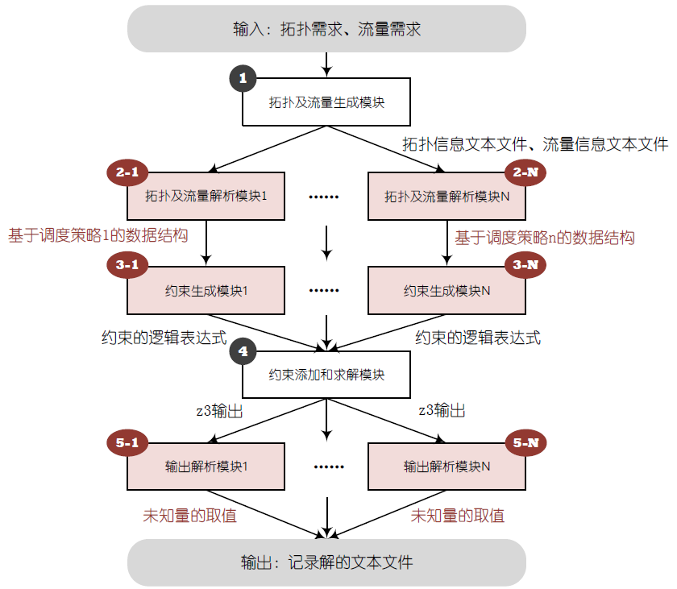

## 功能
* 一个TSN规划器原型，支持集成多种调度策略
* 目前已集成TTTech公司的两种经典调度策略：window-based scheduling和frame-based scheduling
## 运行方法
* bin目录下的py文件可直接运行：`python main_for_frame_demo.py`
### 依赖包的安装
命令：`pip install -r requirement.txt`

## 核心模块

* OpenPlanner包括五个核心模块，各模块的功能如下：
  * 拓扑及流量生成模块：根据拓扑和流量需求生成相应的拓扑和流量，并将其写入拓扑信息文本文件和流量信息文本文件
  * 拓扑及流量解析模块：将拓扑信息及流量信息文本文件内容解析为**与调度策略相关的**数据结构
  * 约束生成模块：将调度约束表示成符合z3语法的逻辑表达式
  * 约束添加和求解模块：将逻辑表达式添加到z3求解器中，并尝试求出一个可行解
  * 输出解析模块：解析z3的输出结果，若有可行解，将可行解写入记录解的文本文件

## 代码结构
└── open-planner  
    ├── bin：可执行的window_demo和frame_demo  
    │   		├── main_for_frame_demo.py  
    │   		└── main_for_window_demo.py  
    ├── lib：与调度策略无关的功能模块  
    │   		├── \_\_init\_\_.py  
    │   		├── lib.py  
    │   		├── topo_and_streams_generator.py：拓扑及流量生成模块  
    │   		├── txt_engine.py  
    │   		└── z3_constraints_solver.py：约束添加和求解模块  
    ├── log：存放解文本文件  
    ├── frame_demo：与frame scheduling策略相关的功能模块  
    │   		├── constraints_constructor_for_frame_demo.py：约束生成模块  
    │   		├── data_structure_for_frame_demo.py：数据结构  
    │   		├── \_\_init\_\_.py  
    │   		├── topo_and_streams_txt_parser_for_frame_demo.py：拓扑及流量解析模块  
    │   		└── z3_model_parser_for_frame_demo.py：输出解析模块  
    └── window_demo：与window scheduling策略相关的功能模块  
          		├── constraints_constructor_for_window_demo.py：约束生成模块  
          		├── data_structure_for_window_demo.py：数据结构  
          		├── \_\_init\_\_.py  
          		├── topo_and_streams_txt_parser_for_window_demo.py：拓扑及流量解析模块  
          		└── z3_model_parser_for_window_demo.py ：输出解析模块 

## 🔗相关链接
1. [z3py tutorial](https://ericpony.github.io/z3py-tutorial/guide-examples.htm)
2. [Programming Z3](https://theory.stanford.edu/~nikolaj/programmingz3.html)
